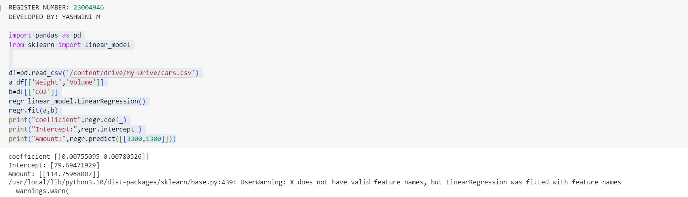

# Implementation of Multivariate Linear Regression
## Aim
To write a python program to implement multivariate linear regression and predict the output.
## Equipment’s required:
1.	Hardware – PCs
2.	Anaconda – Python 3.7 Installation / Moodle-Code Runner
## Algorithm:
### Step1
Import pandas as pa and from sklearn import linear_model

### Step2
Read the csv file from the drive

### Step3
Drive the required list from the file

### Step4
print the list of the program
### Step5
End the program

## Program:
```

import pandas as pd
from sklearn import linear_model


df=pd.read_csv('/content/drive/My Drive/cars.csv')
a=df[['Weight','Volume']]
b=df[['CO2']]
regr=linear_model.LinearRegression()
regr.fit(a,b)
print("coefficient",regr.coef_)
print("Intercept:",regr.intercept_)
print("Amount:",regr.predict([[3300,1300]]))

```
## Output:



## Result
Thus the multivariate linear regression is implemented and predicted the output using python program.